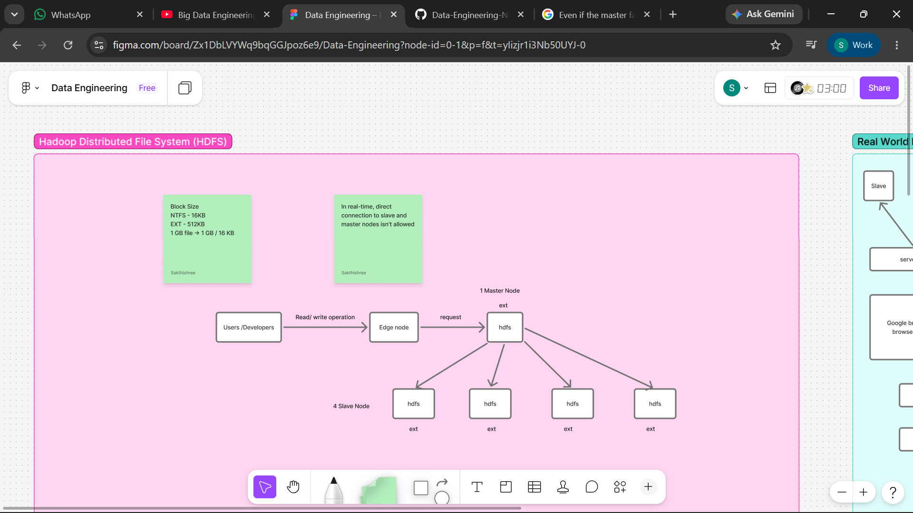

# HDFS (Hadoop Distributed File System)

 **Note:**
- Please refer to the [Figma Board Flowchart](https://www.figma.com/board/Zx1DbLVYWq9bqGGJpoz6e9/Data-Engineering?node-id=0-1&p=f&t=yIizjr1i3Nb50UYJ-0) for the latest visual representations and detailed flowcharts.

## Introduction to Hadoop

Hadoop is a framework that combines two main projects:

1. **HDFS** (Hadoop Distributed File System) - Based on Google File System (GFS)
2. **MapReduce** - Based on Google MapReduce (GMR)

When you download Hadoop, you only get access to HDFS and MapReduce services. Other components like Hive, Pig, Sqoop, and Oozie are built on top of Hadoop. These components need to be downloaded separately and run on top of Hadoop. They require Hadoop as a prerequisite - without Hadoop, they won't work.

**Key Point:** Hadoop itself consists of just HDFS and MapReduce services.

### HDFS Purpose

HDFS is primarily used for storage. In most projects:

- HDFS is used for storage purposes
- Read and write operations happen through HDFS
- Hive processes data by pulling it from HDFS, processing it, and writing results back to HDFS
- Spark also supports Hadoop - it reads data from Hadoop, processes it, and writes output back to Hadoop
- Multiple technologies can read data from Hadoop, process it, and write output back to Hadoop

---

## Technical Terms to Know About Hadoop

### 1. What is a File System?

A file system is used to **read and write** from and to a hard disk.

**Examples:**

- **NTFS** - New Technology File System (Windows file system)
- **EXT** - Extensible File System (Linux file system)
- **HDFS** - Hadoop Distributed File System
- **S3** - Amazon Simple Storage Service

**Classification:**

| Type | Examples |
|------|----------|
| Standard File System | NTFS, EXT |
| Distributed File System | HDFS, S3 |

**How it works:**

- Data reaches the user from the hard disk through the file system
- Writing data also goes through the file system to reach the hard disk
- Data doesn't come directly from the hard disk - there's a process happening in the hard disk

### File System vs Database

**File System:**

- When you write a notepad file, it gets stored on the hard disk through NTFS
- When you double-click a movie or game file, it comes from the hard disk through NTFS
- Data stored through NTFS has **no structure** - it's raw data
- The main difference: NTFS doesn't have any database structure (tables, rows, columns, indexes)

**Database:**

- If you need the 4th record, the database searches and directly retrieves the 4th record details
- File system reads records one by one until it reaches the 4th record (slower)
- File systems don't have fast searching algorithms built in
- In a database, notepad files or movie files get stored in the database first, then go to the hard disk

---

### 2. What is a Block?

A block is a big file divided into small chunks.

**Examples:**

- NTFS: 16 KB block size
- EXT: 512 KB block size

**Detailed Explanation:**

When you store a 1 GB file, it goes through NTFS and gets stored on the hard disk. But it's not stored as a whole 1 GB - it's divided into small pieces (chunks/blocks). These blocks are stored on the hard disk, making read and write operations faster.

**Block Calculation Example:**

- 1 Block Size = 16 KB
- 1 GB = 1024 MB
- 1 MB = 1024 KB

1 GB file → 1 GB / 16 KB = 65,536 blocks

So a 1 GB file gets divided into 65,536 small chunks and stored on the hard disk.

The same scenario applies to EXT file system (Linux OS) - Linux OS has a default block size, and files are divided into blocks based on that size.

**All file systems have the blocks concept.**

---

### 3. Client and Server

- **Client** sends requests
- **Server** sends responses

---

### 4. Types of File Systems

| Type | Examples |
|------|----------|
| Standalone | NTFS, EXT |
| Distributed | HDFS, S3, CFS |

**Difference between Standalone and Distributed File Systems:**

**Standalone Example:**

- 3 Windows PCs connected in a LAN
- If you put a 1 GB file on the 1st Windows system, it gets stored only on that system's hard disk
- It won't be stored on the 2nd and 3rd systems' hard disks
- Whether one system is isolated or 10 systems are connected, data is stored only on the machine where you put it - it won't distribute

**Distributed Example:**

- 3 HDFS machines connected in a LAN
- If you put 1 GB of data on the 1st HDFS machine, it doesn't stay on one machine
- The data gets divided into blocks and stored across all 3 machines
- HDFS divides data first, then processes it in parallel

**Important Note - Two Perspectives:**

| Perspective | Definition of Distributed |
|-------------|--------------------------|
| Network Engineering | Based on machines being connected |
| Data Engineering | Based on data being distributed across machines |

---

### 5. Types of Distributed Systems

| Type | Example | Description |
|------|---------|-------------|
| Master-Slave | Hadoop, Spark | Centralized architecture |
| Peer-to-Peer | Cassandra | All machines are equal |

**Master-Slave Architecture:**

- Similar to client-server
- One server with multiple client machines
- Clients do jobs; server monitors client jobs
- Communication only happens between master and slave
- Slave-to-slave communication doesn't happen
- If one client crashes, other slaves don't know - only the master knows
- Master decides what to do next

**Disadvantages of Master-Slave:**

- **Centralized system**
- **SPOF** (Single Point of Failure) - if the master goes down, the system fails
- **SPOC** (Single Point of Communication) - all slaves communicate with only one master

**Peer-to-Peer Architecture:**

- All machines are equal
- Each machine communicates with each other
- If one machine crashes, other machines know
- No SPOF or SPOC issues
- No master to control slaves

**Most big data technologies follow the master-slave architecture.**

---

### 6. What is a Process?

A program in execution.

---

### 7. What is a Daemon Process?

A background process.

---

### 8. Cluster and Node

- **Node** - Individual physical machine (laptop, desktop) or virtual machine (AWS cloud, Google Cloud)
- **Cluster** - Group of nodes (e.g., 4 laptops connected together form a cluster)

---

### 9. What is Client API?

**API** - Application Programming Interface

Used to communicate with the machine. Whenever you send a request, it goes through the API.

---

## Hadoop Installation Overview

### Version Information

- Hadoop Version 0 and 1 - Not used in real-time
- Hadoop Version 2 and 3 - Used in real-time

### Supported Operating Systems

- Windows OS
- Linux OS
- macOS

### Installation Requirements

- A standalone OS is needed to create a distributed environment
- Real-time projects use complete Linux OS
- Best to learn with Linux OS based environment

### File Format

- Many software downloads offer 32-bit or 64-bit options
- Hadoop doesn't work that way - it's a single tar file
- Tar extension is used for Linux OS
- The same Hadoop tar file is used for both master and slave
- Whether a machine becomes master or slave depends on configuration
- Master and slave configurations are different

---

## Hadoop Distributed File System - Architecture

### Setup Scenario

Imagine installing a Hadoop cluster for a client:

1. Client asks: Physical machines or virtual machines?
2. You request: 5 virtual machines on AWS or Google Cloud
3. All 5 machines have Linux OS with EXT file system
4. All machines are on the same network with IP addresses
5. You install Hadoop on all 5 machines
6. You decide: Machine 1 becomes master (needs more RAM and configuration), remaining machines become slaves

### Key Concept: Two File Systems

After installation, each machine has **two file systems**:

1. **EXT** - Standalone file system (Linux OS)
2. **HDFS** - Distributed file system

When you put data using EXT commands, data doesn't get distributed. When you put data using HDFS commands, data gets distributed.

**Important Understanding:**

A standalone machine can host a distributed file system on top of it.

### Real-World Example

  

When you upload a picture to Facebook:

- The picture file is on your local machine (EXT or NTFS file system)
- You upload it through your browser
- Facebook's servers distribute the file across their slave machines
- The 500 MB picture gets divided into chunks and stored across slaves
- Facebook.com sends requests to the master machine
- The master machine distributes data to slave machines

---

## Edge Node Concept

  

### What is an Edge Node?

As a developer, you shouldn't connect directly to the cluster machines. You're given a separate machine called an **edge node** to connect to the cluster.

### How it Works

- Developers connect to the edge node for read/write operations
- The edge node sends requests to the master
- In real-time, direct connection to slave nodes isn't allowed
- Master and slave nodes should never be directly communicated with by developers

**Example:**

- Facebook.com is like an edge node
- Through Facebook.com, you access the Facebook cluster
- You can't directly access the Facebook cluster
- When you upload a picture, it goes to the Facebook cluster through the edge node

### Best Practices

- Edge node has a 1 GB file to upload
- Uploading to cluster means distributing it across all 4 nodes
- Once uploaded to the cluster, you can delete it from the edge node
- Direct upload to slave nodes is not best practice - it pollutes the system
- Google Drive example: Files uploaded to Google Drive are stored on Google's servers, not your machine
- The edge node acts like a firewall

**Common Misconception:**

Many people think the edge node is a Hadoop slave node, but it's not. In real-time, this isn't allowed. The node you connect to for running read/write requests and jobs is never one of the slave nodes. Master and slave nodes can only be accessed by administrators.

---

## HDFS Read, Write, and Request Architecture

### Write Architecture

  

**Scenario:** 1 GB file needs to be written to HDFS from a slave node (for architecture understanding - in real-time, this happens through the edge node).

**Step-by-Step Process:**

1. **File Location:** The 1 GB file is on the local file system (EXT) of the slave node
2. **Command Execution:** When you execute an HDFS upload command, a **client API** is created
3. **Request to Master:** The client API sends a write request to the master with information:
   - File name (e.g., test.txt)
   - File size (1 GB)
   - Write operation request
4. **Important:** The actual data doesn't go to the master - only metadata information goes to the master

### Block Size Details

| Hadoop Version | Default Block Size |
|----------------|-------------------|
| Version 1 | 64 MB |
| Version 2 | 128 MB |

- Block size can be changed
- Always a multiple of 2 (64, 128, 256)
- 1 GB / 64 MB = 16 blocks

### Metadata

**Definition:** Data about data.

When the master receives a write request:

- It calculates how many blocks to create (1 GB / 64 MB = 16 blocks)
- It prepares metadata information
- Metadata stores all information about the file:
  - Number of blocks
  - Which blocks are on which machines
  - Block locations
- Metadata is stored in the master machine's EXT file system
- Metadata is not distributed - it's stored on one machine

### Replication

**What is Replication?**

- When data is distributed, it's also replicated (copied)
- If one node fails, the replica on another machine ensures no data loss
- Default replication factor: **3** (1 actual + 2 copies)
- Replication factor can be changed
- Same machine never stores two copies of the same block

**Example:**

- 16 blocks × 3 replicas = 48 blocks total
- 1 GB file requires 3 GB of hard disk space

### Cost Consideration

**Question:** If replication requires 3GB storage, why not disable it to save costs?

**Answer:** Replication cannot be disabled because data loss recovery is more expensive than maintaining copies.

**Hardware Cost - Both Need to Pay:**

| Item | Traditional Technology | Hadoop (Modern) |
|------|------------------------|-----------------|
| Hardware (Hard disk) | 💰 Required | 💰 Required |
| Software License | 💰 Paid | 🆓 Free |
| Replication Software | 💰 Separate purchase | 🆓 Built-in |
| **Total Cost** | **Hardware + Software = 3x** | **Hardware only = 1x** |

**Key Points:**

- Hardware cost is SAME in both (need storage for replicas)
- Hadoop saves money on SOFTWARE cost (free, built-in replication)
- Traditional technology needs separate software for replication (paid)
- Hadoop handles replication automatically - just attach hard disks
- Replication cannot be disabled - data loss recovery is more expensive

### Rack Awareness Algorithm

- Decides where each copy should be stored
- Ensures no two copies are on the same node
- Determines placement allocation for each block
- All this information is stored in metadata

### Write Pipeline Process

1. Master sends response to client API with:
   - Block division information
   - Replication factor
   - Node placement for each copy

2. Client API:
   - Takes the 1 GB file from the slave node
   - Divides it into 16 blocks
   - Creates 3 copies of each block
   - Distributes blocks across nodes using a **pipeline**
   - Pipeline is a process created by the client API

3. Pipeline process:
   - Checks each node for availability
   - Places blocks on available nodes
   - If a node is unavailable, moves to the next node
   - All nodes communicate through the pipeline

4. Completion:
   - After all blocks are distributed, response goes to client API
   - Client API notifies master
   - Client API connection closes

### Heartbeat Communication

  

- Master and slaves communicate every 3 seconds
- This is called **heartbeat**
- Purpose: To know if each slave is alive
- Happens regardless of read/write operations
- If a slave doesn't send heartbeat for 3 seconds, master knows the machine has a problem

---

## Hadoop Daemon Processes

Hadoop is a process.
JP-> Java Process 

When Hadoop process starts, **5 daemon processes** run in the background:

**Note:**
- Secondary Name Node is a dummy node.
- The Secondary Name Node captures the status of the Name Node.

| Process | Name | Responsibility |
|---------|------|----------------|
| JP1 | Name Node | Master daemon |
| JP2 | Data Node | Slave daemon |
| JP3 | Secondary Name Node | Checkpointing |
| JP4 | Job Tracker (H1 Version) / Resource Manager (H2 Version) | MapReduce master |
| JP5 | Task Tracker (H1 Version) / Node Manager (H2 Version) | MapReduce slave |

- Hadoop source code is in Java
- Each process does a specific job
- Master machine runs JP1
- All slave machines run JP2

---

## Failure Handling in HDFS

### Types of Failures

| Failure Type | Duration | Description |
|--------------|----------|-------------|
| Software/Network Failure (S/W or N/W) | Temporary | Machine comes back after troubleshooting |
| Hardware Failure (H/W) | Permanent | Machine needs full replacement |

**Note:** Both failures can happen to BOTH Slave nodes AND Master nodes.

---

### Slave Node Failure - Temporary (Software/Network Failure)

**Scenario:** 2nd slave node fails after write operation

**What happens:**

1. Master doesn't receive heartbeat from the failed node
2. Master identifies that 2nd node has failed
3. If a user requests data, HDFS serves from other nodes
4. User/Developer doesn't know about the failure
5. Master tries to recover data by creating new copies on other nodes
6. This is called **Automatic Failover**
7. Metadata gets updated when blocks are moved to new locations

**Important Point:**

- Replication is always maintained at the configured(default) level
- If one copy fails, master creates another copy on a different node
- Already existing block's copy will NOT be placed on the same node again

**Example with b0 and b15:**

  

- 2nd Slave Node has: b0, b15
- 2nd Node fails temporarily

- Step 1: Master detects no heartbeat
- Step 2: Master tries to copy b0 to 3rd node (no copy there)
- Step 3: b0 copied to 3rd node ✅
- Step 4: Metadata updated - b0 now on 3rd node

- Step 5: Master tries to copy b15
- Step 6: But 2nd node recovers (temporary failure)
- Step 7: Heartbeat comes back
- Step 8: b15 copy NOT needed - machine is back

**Result:**

- b0 was copied to 3rd node (because 2nd node was down)
- b15 stayed on 2nd node (machine recovered before copy)
- 2nd node comes back with b0, b15
- But master considers 2nd node's b0 as LOCAL FILE (not valid)
- Master deletes b0 from 2nd node (waste of hard disk space)
- Why delete b0 from 2nd node?
- Metadata already updated: b0 is on 1st, 3rd, 4th nodes
- 2nd node's b0 is no longer part of replication
- It's just taking up hard disk space

**Important Rule:**

> Even if a node fails TEMPORARILY, treat it as PERMANENT failure and add a new machine immediately. This is a BEST PRACTICE for slave nodes.

---

### Slave Node Failure - Permanent (Hardware Failure)

  

- Same automated process happens
- A new machine is added to the cluster
- Automatic failover creates missing copies on the new machine
- The new copy is placed on a machine that doesn't already have that block

**Best Practice:** Add a new machine immediately when permanent failure occurs.

---

### Master Node Failure

**Impact:**

- Master is the single point of failure
- Metadata is on the master
- All operations stop (read, write, requests)
- Everything running on Hadoop stops
- Even read requests cannot be processed

---

### Master Node Failure - Temporary (Software/Network Failure)

- Metadata file is safe on the hard disk
- Machine is down, so requests cannot be processed
- But after troubleshooting, machine comes back
- Metadata is still intact
- No permanent data loss

**Solution:** Troubleshoot and bring master back online

---

### Master Node Failure - Permanent (Hardware Failure)

- Hard disk fails → Metadata completely crashes
- Even if new master machine is created, metadata file is lost
- Without metadata, you don't know:
  - Which blocks are on which nodes
  - Where data is located
- This is CRITICAL!

**Solution:**

- Metadata file must be secured with multiple copies
- Store metadata copies on different nodes
- Use backup and recovery systems
- Keep metadata in safe storage

---

### During Write Operation Failure

Note: We have already seen what happens after a write operation fails. But we have not seen what happens if a failure occurs during a write operation.

**Scenario:** Metadata created, client API ready, but node fails during write

Example: b0 needs to go to 2nd node

  

During write:

- 2nd node machine fails

What happens:

1. Client API detects 2nd node failure
2. Client API sends acknowledgment to master
3. Master decides another machine for b0
4. Master updates metadata
5. Write does NOT fail
6. Write only fails if ALL 4 slave machines are down

---

### Read Operation Failure

  

**Scenario:** Reading data, but copy fails

Reading b0:

- 3 replicas available (1st, 3rd, 4th nodes)

Client API reads from 1st copy

If 2nd copy fails during read:

- Response tells client API: 2nd copy failed
- Client API tries 3rd copy
- Client API sends acknowledgment to master
- Read is successful from 3rd copy

**Key Points:**

- Pipeline is ONLY for write, NOT for read
- Read is direct from nodes
- Only ONE copy is read (not all 3)

---

### High Availability (HA)

  

**Question clients ask:** "Does your cluster have HA?"

High Availaility :
Even if the master fails, the cluster should keep running. The cluster should NOT stop working.

**Hadoop Version 0 and 1:**

- No HA support
- If master fails, wait for troubleshooting and recovery
- Master must be brought back manually

**Hadoop Version 2:**

- Introduced **two name nodes**:
  1. **Active Name Node**
  2. **Passive Name Node**
- At any time, only one name node is active
- Active name node handles all read/write requests
- Passive name node stays silent, receives heartbeat from all data nodes
- Both share metadata through **Journal Node** (common machine)
- If active fails, passive becomes active
- When failed node recovers, it becomes passive
- This swap happens continuously

**Name Node Details:**

| Feature | Active Name Node | Passive Name Node |
|---------|-----------------|-------------------|
| Role | Master | Standby |
| Requests | Handles ALL | Handles NONE |
| Heartbeat | Receives | Receives |
| Metadata | Writes | Reads (sync) |
| Status | Active | Silent |

**Rule:**

- You can have 10 name nodes
- But only 1 is ACTIVE at a time
- Remaining 9 are PASSIVE
- If active fails, one passive becomes active
- Failed active recovers → becomes passive

---

### Zookeeper - Cluster Coordinator

- Distributed technology
- Decides which name node becomes active
- Has leader and followers
- Monitors active and passive name nodes
- If active name node dies, Zookeeper promotes passive to active
- Zookeeper itself has HA (if leader fails, a follower becomes leader)

**Zookeeper Setup:**

4-5 Zookeeper nodes:

- ZK-1 → Leader
- ZK-2 → Follower
- ZK-3 → Follower
- ZK-4 → Follower

These 4 nodes together decide:

- Who becomes active name node
- Who stays passive

If Leader ZK fails:

- Next follower becomes leader immediately

Zookeeper has HA - no problem

---

### Metadata Storage - Where?

| Component | Storage Location |
|-----------|-----------------|
| Active Name Node | Writes metadata |
| Passive Name Node | Reads metadata (sync) |
| Journal Node | Common shared storage |

**Important:**

- Active and Passive Name Nodes access metadata from Journal Node
- Journal Node is a common machine
- Both nodes share this common storage
- This ensures metadata is always in sync

---

## Hadoop Version 1 vs Version 2

### Types of Nodes - Hadoop 1

| Node Type | Components |
|-----------|------------|
| Master Node | Name Node + Job Tracker |
| Slave Node | Data Node + Task Tracker |
| Secondary Node | Secondary Name Node (Checkpointing Node) |

### Types of Nodes - Hadoop 2

| Node Type | Components |
|-----------|------------|
| Active Master Node | Active Name Node + Active Resource Manager |
| Passive Master Node | Passive Name Node + Passive Resource Manager |
| Secondary Node | Secondary Name Node |
| Zookeeper Node | Quorum Node |
| Journal Node | Shared metadata storage |

**Note:**

- If you configure Hadoop 2 with passive name node, secondary name node isn't needed (passive does its job)
- If you configure Hadoop 2 without passive name node, secondary name node is required
- In Hadoop 2, Job Tracker was renamed to Resource Manager
- In Hadoop 2, Task Tracker was renamed to Node Manager

---

## Types of Clusters

### 1. Single Node / Pseudo Cluster

**Characteristics:**

- Distribution doesn't happen
- Data stays on one node - no actual distribution
- All daemons run on one node
- Used for testing and learning purposes
- Replication doesn't happen (single node)
- Called "pseudo" because it's a false cluster

**Daemons on single node:**

| Hadoop 1 | Hadoop 2 |
|----------|----------|
| Name Node | Name Node |
| Data Node | Data Node |
| Job Tracker | Resource Manager |
| Task Tracker | Node Manager |
| Secondary Name Node | Secondary Name Node |

### 2. Distributed Node / Fully Distributed Cluster

**Hadoop 1 - Minimum 5 Nodes:**

| Node | Purpose |
|------|---------|
| 1 Node | Master (Name Node + Job Tracker) |
| 1 Node | Secondary Name Node |
| 3 Nodes | Slaves (Data Node + Task Tracker) |

**Why minimum 5 nodes?**

- Default replication factor is 3
- Need at least 3 slave nodes for 3 replicas

**Hadoop 2 - Node Distribution:**

| Nodes | Purpose |
|-------|---------|
| 2 Nodes | Active + Passive (Name Node + Resource Manager) |
| 2 Nodes | Zookeeper |
| 2 Nodes | Journal Nodes |
| 3 Nodes | Data Nodes + Node Managers |

**Important:**

- Master daemons can be on separate machines or together
- Slave daemons (Data Node + Node Manager) must be on the same machine
- Master and slave daemons should not share the same machine

---

## Summary

HDFS is a distributed file system that:

- Divides large files into blocks
- Distributes blocks across multiple machines
- Maintains replication for fault tolerance
- Uses master-slave architecture
- Provides high availability through active-passive name nodes
- Automatically handles failures through failover
- Stores metadata on the master, actual data on slaves
- Uses heartbeat for health monitoring
- Supports edge nodes for developer access
- Scales horizontally by adding more data nodes
