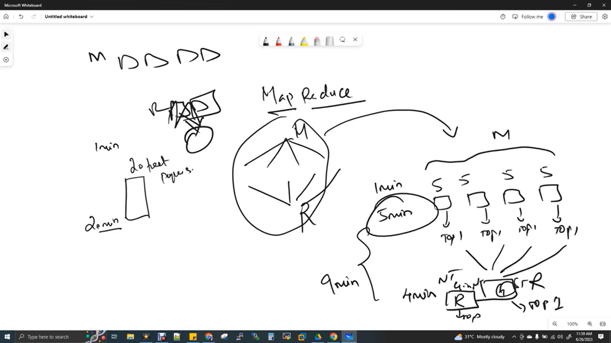
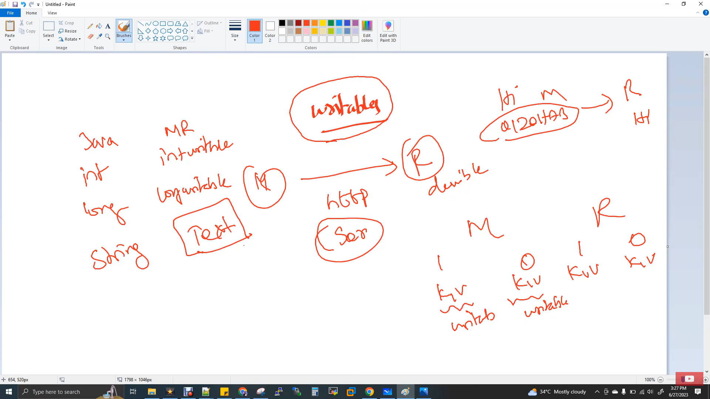

# MapReduce

> A complete guide to Hadoop's processing engine — architecture, flow, formats, and internals.

---

## MapReduce Agenda

- MapReduce Introduction
- MapReduce Daemons and Its Architecture
- MapReduce Program Flow
- MapReduce Input and Output Formats
- MapReduce Data Types
- MapReduce Code Walkthrough
- MapReduce YARN Architecture
- MapReduce V1 vs V2
- MapReduce Project Setup in IDE
- MapReduce JAR File Creation
- MapReduce Code Execution in Cluster
- Input Splits
- Speculative Execution

---

## Table of Contents

1. [MapReduce Introduction](#1-mapreduce-introduction)
2. [Technical Terms to Know About Hadoop](#2-technical-terms-to-know-about-hadoop)
3. [Important Questions and Answers](#3-important-questions-and-answers)
4. [Hadoop Old Version (V1) Job Architecture](#4-hadoop-old-version-v1-job-architecture)
5. [MapReduce Program Flow](#5-mapreduce-program-flow)
6. [MapReduce Input and Output Formats](#6-mapreduce-input-and-output-formats)
7. [MapReduce Input and Output Diagram](#7-mapreduce-input-and-output-diagram)
8. [DataTypes in MapReduce](#8-datatypes-in-mapreduce)

---

## 1. MapReduce Introduction

MapReduce (MR) is one of the **core components** in Hadoop. We can call it the **engine of Hadoop**.

Hadoop has 2 major components:

| Component | Purpose |
|-----------|---------|
| **HDFS** | Stores data in a distributed way |
| **MapReduce** | Processes the distributed data in parallel |

### History

- HDFS was derived from **Google File System (GFS)** — a research paper Google invented.
- Google released a research paper called **GMR (Google MapReduce)** in 2006.
- From that paper, **MapReduce (MR)** was invented.

---

## 2. Technical Terms to Know About Hadoop

**MR = MapReduce**

### 2.1 What is MR called?

It is a **processing framework**, or we can say MapReduce is an **engine in Hadoop**.

Many people call MapReduce a "MapReduce algorithm." It is actually a **framework built from an algorithm**. Instead of calling it an algorithm, we can call it **batch processing**.

Generally, there are 2 types of processing:

| Type | Description | Example |
|------|-------------|---------|
| **Batch Processing** | Data comes from the frontend. You receive data in an application or on an Amazon website, store it in a DB or file, and after storing, you process the full data. | At the end of the month, you check your bank statement to see last month's transactions. |
| **Stream Processing** | Real-time data. As soon as a transaction happens, they capture it and process it immediately. | When you go to a departmental store and swipe your card or use GPay, the amount gets debited as you swipe. |

> **Important:**
> - MapReduce **only does batch processing**. It does **not** do stream processing.
> - MapReduce only reads data that has **already fallen into it**. It does not take data that is already in stream.
> - If you write and deploy code for batch processing, the program will **finish as soon as the input is finished**.
> - For stream processing, the code will run for **24 hours** because you don't know when real-time transactions will come (e.g., Spark Streaming).

### 2.2 What language do we use in MR?

The programming language used is **Java** by default.

MapReduce supports **C, C++, Java, Python** — about 6 to 7 languages. But we still go for **Java** because it gives **better performance** compared to other languages.

> **Note:**
> - Many frameworks support a minimum of 3 languages.
> - **Spark** supports Python, Scala, and Java. Spark gives you better performance in any language.
> - But **MapReduce is not like that**. You have to write it in **Java**.

### 2.3 Advantages / Why MR?

This question is not just for MR. For any framework, the advantages are the same. **MR processes in parallel.**

When we write in a framework, we only need to focus on our **logic/query**. The framework takes care of:

| Feature | Description |
|---------|-------------|
| **Cluster Monitoring** | If a node fails, your code will not be killed, your data will not be lost, and processing will continue. |
| **Resource Allocation** | How much RAM is needed, how many threads are needed for these jobs — the framework takes care of all this. |
| **Cluster Management** | If a node fails, the job will restart on another node. |
| **Scheduling** | Which job should run first, which job next — the framework handles this. |
| **Execution** | Executing your code properly and giving results. |
| **Speculative Execution** | A type of execution (explained in upcoming concepts). |

> **Why go for a framework?**
> Even though I know programming and logic, the reason we go for a framework is because it provides all of the above. Spark also has all of this, plus many additional features.

### 2.4 Aim of MR?

To achieve **data locality**.

> **Example:**
> You have 1 GB of data already placed in HDFS, split across 10 nodes. Now you write a program in MR for this 1 GB. Your program will find all the data pieces across the 10 different nodes and **run the process on those nodes**.

### 2.5 Main use of MR?

**Parallelism**.

We split our job into tasks and process each task in parallel.

### 2.6 Abstraction of MR?

**Hive, Pig, Sqoop, Oozie**

In MR, you have to write Java. But if you say "I don't like writing Java for MR," then you can use any of these 4:

| Tool | Purpose | Invented By |
|------|---------|-------------|
| **Hive** | Uses SQL | Facebook |
| **Pig** | Uses Pig Latin script | Yahoo |
| **Sqoop** | Takes data from RDBMS databases and brings it into Hadoop | — |
| **Oozie** | A scheduler | — |

> **Key Point:**
> All 4 of these **run on the MR daemon and engine**. Without MR, none of these 4 can run.

**Detailed Explanation:**

- **Hive** → Facebook invented Hive because they liked MR a lot but didn't like writing in Java. In Java, 20 lines of code would be 2 or 3 lines in SQL. Hive is like a **language mediator** — you speak SQL, but Hive converts it to Java and talks to MR.

- **Pig** → Yahoo invented Pig for the same reason. They knew Pig Latin script and wanted to use it in MR.

- **Sqoop** → Used to move data from RDBMS to Hadoop using Sqoop commands. Before Sqoop, we wrote full MapReduce code to connect to MySQL database, get data, put it in HDFS, and process it.

- **Oozie** → A scheduler. You can schedule Hive jobs, Pig jobs, HDFS jobs, MR jobs. For example, you want to run an MR job, then after its output, run a Hive job, and after that finishes, put it in HDFS — once every hour.

> **Very Important Point:**
> Hive, Pig, Sqoop, Oozie are **NOT alternatives to MR**. Many people make this mistake. They are not alternatives. The alternative is for the **Java in MR**. The alternative to MR is **Spark**.

### 2.7 Alternative of MR?

**Spark**

### 2.8 Daemons in MR?

| Hadoop Version | Daemons |
|----------------|---------|
| **Hadoop V1** | JobTracker and TaskTracker |
| **Hadoop V2 & V3** | ResourceManager and NodeManager |

### 2.9 Map and Reduce — The Core Concept

| Component | Purpose |
|-----------|---------|
| **Map** | Parallelism |
| **Reduce** | Grouping |

If we want to use MR, data must be **distributed and stored**. That is what we do in **HDFS**.

### 2.10 Traditional Example: School Teacher Correcting Papers

  

**Scenario:** Exams are over, and 20 test papers need to be corrected. One test paper takes 1 minute to correct.

| Approach | Time Taken |
|----------|------------|
| **Single Resource** | 20 papers × 1 minute = **20 minutes** |
| **Distributed (4 machines, 5 papers each)** | 5 minutes (parallel processing) |

**How it works:**

1. **HDFS** splits these 20 papers across **4 machines** — 5 papers each.
2. **4 resources (teachers)** start correcting in parallel.
3. Each teacher takes 1 minute per paper. In 5 minutes, all 4 resources finish.
4. **Complete parallel processing finishes in 5 minutes.**

**Now, think about the 10th public exam results:**

- They correct papers **district-wise**.
- They announce the **district first**.
- Then they send all district firsts to the **state capital** and consolidate to decide the **state first**.

**MapReduce Equivalent:**

| Step | Description |
|------|-------------|
| **Map Phase** | 4 resources pick the top 1 from their 5 papers (district firsts announced in parallel). |
| **Reduce Phase** | These 4 outputs go to another resource. That resource gets 4 inputs and picks one topper from those 4 inputs (state first). |

> **Time Calculation:**
> - 4 minutes for parallel staff correction + 5 minutes = **9 minutes total**
> - Instead of 20 minutes, we finished in 9 minutes.
> - That's about **60% performance increase**.

**What if we need 2 results (2 state firsts)?**

- Split the state into **South Tamil Nadu** and **North Tamil Nadu** — each gets a state first.
- 4 resources correct their papers, and then there are **2 reducers**.
- One picks the top 1 from North Tamil Nadu, and the other picks the top 1 from South Tamil Nadu.

> **Key Insight:**
> However many output partitions you need, that's how many **reducers** you increase in the code.

---

## 3. Important Questions and Answers

  

### 3.1 Who decides the map count?

**Two Options:**

1. **Number of blocks = Number of mappers**
2. **Number of nodes = Number of mappers**

**Correct Answer: Option 1 — Number of blocks = Number of mappers**

**Why Option 2 is not correct:**

> **Example:**
> Suppose I have 4 blocks (B0, B1, B2, B3). Let's name them **Karur, Erode, Coimbatore, and Trichy**.
>
> - Suddenly, there is an issue in **Erode** — a strike happens, and the teachers there cannot correct papers.
> - So I cannot announce the district first. But the state first cannot be announced until Erode district finishes.
> - **If one mapper does not give output, the entire job's output cannot be given.**
> - Because the reducer will start only when **all mappers complete**. That is the rule.
>
> **Just like election results** — the final result must wait for all mappers to give output.

**What happens in this situation?**

- The staff here cannot be changed. They tell the block next to B1 to move to Karur district.
- The B1 paper parcel comes to Karur.
- Here, resources are already booked. They are correcting B0. They cannot be told to correct again.
- In Erode, resources are already hired, but they cannot work due to the strike.
- **So what do I do?** I hire resources again in Karur to correct B1.

**Result:**

| District | Mappers |
|----------|---------|
| Karur | M1, M2 |
| Coimbatore | M3 |
| Trichy | M4 |

- **Number of nodes = 3**, but **there are 4 mappers**.
- So "number of nodes = number of mappers" is **not correct**.

> **Final Answer: Number of blocks = Number of mappers**
> - B1 and B2 can be on the same node.
> - It is guaranteed that 2 blocks can be on the same node.
> - So 2 mappers are created there.

**Important Note:**

"Number of blocks = Number of mappers" is **not always equal**.

- In the mapper, we can do a setting.
- One block B1 can trigger **2 mappers** M1, M2 for faster job processing.
- For example, if you have a lot of RAM, instead of one mapper per block, you can put 2 mappers per block.
- **But still, it is block-based. Mappers are not node-based.**

**Interview Answer:**

> **Q:** "What is the number of mappers based on?"
>
> **A:** "Number of blocks" — and this is changeable.
> - MapReduce has a property through which we can say that one block can run 2 mappers.
> - Similarly, we can reduce it.
> - If there are 2 blocks B0, B1, first rule: 2 blocks means 2 mappers.
> - Or both can be done with one mapper M1.
> - If there is no RAM, you can run it with the available RAM.
> - If you give more RAM, you can run 2 mappers for one block.
> - So 2 blocks can have 4 mappers: B0 → M1, M2 and B1 → M3, M4.

---

## 4. Hadoop Old Version (V1) Job Architecture

### (JobTracker and TaskTracker)

  

In MapReduce, we write Java code. After writing, what do we do?

**We convert it to a JAR.** JAR = Java Archive.

After archiving, we send the code to production and run it. So MapReduce shows all this. In MapReduce, a developer must **convert their code to a JAR and submit it to the cluster**.

### 4.1 The JobTracker — The King

When submitting the job, the request goes to the MapReduce daemon (**JobTracker and TaskTracker**).

> **The JobTracker is like the king.**
> - Just as **NameNode** is the leader in Hadoop, for MapReduce, the **JobTracker** is like that.
> - **NameNode is the king, JobTracker is the queen.**
> - Together they are called the **master**.
> - These two are not separate masters — **together they are one master**.

### 4.2 How Job Submission Works

**Step 1:** The request goes to the **JobTracker**.

**Step 2:** The JobTracker receives the request and does:
- Cluster management
- Resources
- Resource allocation
- Scheduling
- Speculative execution

**Step 3:** But for the JobTracker to do all this, it needs to know **where your input file is**.

- You are sending a request to run a MapReduce JAR on an input.
- The JAR file is ready, and it needs to run on the input.
- So the JobTracker needs to know **where the input is**.

**Step 4:** For that, the JobTracker **connects to the NameNode**.

- Why? Because the NameNode has all the **metadata information** about your input file.
- That is, for this particular input request, how many blocks it is split into, which blocks are where, how many replications there are — all this information is in the NameNode's metadata.

**Step 5:** The JobTracker asks the NameNode for the **block details** of the job.

> **Example:**
> - You are sending a JAR file and a `data10.txt` file as input.
> - You are running your JAR on this input.
> - So the JobTracker asks the NameNode to send the block details of `data10.txt`.
> - The NameNode has split this file into **3 blocks**: b0, b1, b2.
> - Each block is replicated **3 times**.
> - It sends all the details of which nodes (machine addresses) the replicas are on to the JobTracker.

### 4.3 Slave Nodes — DataNode and TaskTracker

Now we have slave nodes. Let's say we have **4 slave nodes**.

| Component | Belongs To |
|-----------|------------|
| **TaskTrackers** | JobTracker's slaves |
| **DataNodes** | NameNode's slaves |

> **Note:** A slave node is a **combination of DataNode and TaskTracker**.

**What does the NameNode say?**

> "For `data10.txt`, there are 3 blocks. There is also replication, but for now, we don't need replication."

**Why replication?**

- MapReduce will process **only one copy**.
- You have multiple copies. Why? If one node goes down, the other copy is on another node, and we can take it from there.
- So Hadoop will not say "a node failed and the data is gone."
- That is **fault tolerance** in HDFS.

**In MapReduce, only one copy is processed.**

> **Why?** Doing the same processing again and again on the same input is a waste. So MapReduce will do one. If it is not available, it will take the 2nd copy.

**Example:**

| Block | Node |
|-------|------|
| b0 | 1st node |
| b1 | 3rd node |
| b2 | 2nd node |

The DataNode controls which block is where.

### 4.4 Task Execution

Once the JobTracker gets all this information, it connects to the **TaskTrackers** on those slave nodes **in parallel**.

**What happens next?**

1. The JobTracker connects to the TaskTrackers on the 3 machines and tells them to run the JAR file.
2. The JAR file contains your **map code + reducer code**.
3. The JobTracker tells them to run **only the map code first**.
4. It gives instructions to the 3 TaskTrackers to start the process **in parallel**.

**Just like the professor corrects papers at the same time.**

Similarly, the TaskTracker creates a task for each map request. It creates a **JVM (Java Virtual Machine)**.

- This will go to all three blocks (b0, b1, b2) in the node and process them.
- While processing, it sends **heartbeats** (information like "I am alive," "the task is running or not") to the JobTracker **every 3 seconds**.
- Through this, the JobTracker knows whether the job is finished or failed.

### 4.5 Failure Handling

**Suppose the 2nd node fails. What happens to the task that was running?**

> You said if one mapper does not run, it will not give a result. So what happens?

**Scenario:** b2 on the 2nd node fails.

1. The JobTracker checks where the **replica of b2** is.
2. The replica is on the **3rd node**.
3. So the JobTracker assigns a task again to the 3rd node and tells it to run b2 there.
4. It creates another task here.

> **Result:** Even if a task fails because the machine is not available or data is not available, **the whole job does not fail**. The task is reassigned to the 2nd replica.

**How does the TaskTracker read data?**

- The TaskTracker launches the task.
- It processes b0, b2, b1.
- The TaskTracker connects to the **DataNode** and reads and processes the data.
- This is called **lookup**.

### 4.6 Map Output and Reducer

**Suppose 3 mappers finish.**

Now we call this the **Map Output**.

> **Where is the mapper's output stored immediately after the map finishes?**
>
> **Answer:** It is stored **temporarily in the local file system** of that node.

**What happens next?**

1. All mappers tell the TaskTracker, "We have finished."
2. Then the JobTracker starts the **reducer** on the next node.
3. **Does the reducer start on a free node, or does it start on the node where the map finished?**
   - That is up to the JobTracker.
   - It may start the reducer on the node where the map finished, or it may assign the reducer task to a new free node and start the TaskTracker there.
4. The JobTracker tells the 3 mapper machines: "You have kept your output locally. Send it to the reducer."
5. So the output from all machines goes to the reducer.
6. The protocol used for this is **HTTP (HyperText Transfer Protocol)**.
   - This is a general network protocol.
   - Through this, the mapper's output goes to the reducer.
7. As soon as the reducer gets the input, it starts processing.

> **Important:**
> - The reducer's input comes from the **mapper's output**.
> - But the mapper's input comes from **blocks**.
> - This is very important.

**Final Output:**

- Once the reducer finishes its process, it stores its output in **HDFS**.
- So both input and output are stored in HDFS.
- Or you can store it in a particular file system, database, or NoSQL.
- **By default, MapReduce reads from HDFS and writes to HDFS.**

### 4.7 JVM Configuration

**How does the TaskTracker behave by default?**

- The TaskTracker gets a task assigned by the JobTracker.
- The JobTracker assigns only **one map task**.
- So the TaskTracker launches **one JVM** for that one map task.

**But wait — why launch 2 JVMs?**

> This is the **default configuration**. The mapper's child process launches **2 JVMs** whenever a task comes.
> - For example, if there is only one map task, one JVM is used, and the other is not used.
> - So by default, it launches **2**.

**Example:**

| Scenario | JVMs Launched |
|----------|---------------|
| TaskTracker has 2 blocks (b0, b1) | 2 JVMs — one for b0, one for b1 |
| TaskTracker has 1 block | 1 JVM |
| TaskTracker has 3 blocks (b0, b1, b2) | 2 JVMs — b0 and b1 run, b2 waits in queue |

> **Key Point:**
> - b0 does **not** wait for b1 to finish.
> - The TaskTracker starts both.
> - By default, **2 JVMs**.
> - It does not look at whether there are 4, 3, 2, or 1 blocks. It launches **2 JVM tasks**.
> - If there are 3 blocks, one task runs for b0, another for b1, and b2 waits in the queue.
> - When one of the two finishes, b2 goes next.

**Can I increase parallelism?**

> **Yes, definitely.**
> - If you want to increase parallelism, you can do it.
> - That is this particular property: **The map child task default is 2**.
> - You can increase it to 3, 4.
> - But as a developer, I don't know how many blocks are split on that particular TaskTracker node.
> - So until it finishes, you can increase parallelism.
> - It depends on the company.
> - This property is set in **`mapred-site.xml`**.
> - Each company has different configurations. They set a default number in the configuration.

**What if I set it to 3?**

- If you remove it and put 3, then whenever a task request comes from the JobTracker to a TaskTracker, it will release **3**.
- Whether there are 3 blocks or 1 or 2 blocks, it will launch **3 JVMs**.
- But if there is 1, it will use only that one and keep the other 2 **idle**.
- That means it won't use them.
- You might ask: "If 3, then launching 3 at a time is a waste of resources."
- But it's not like that. It will use them if needed, or leave them.
- If the blocks exceed the task limit, the extra blocks **wait in the queue**.

### 4.8 V1 Limitation

**In V1, if the JobTracker fails, nothing can be done.**

- Running MapReduce jobs, Hive jobs, Pig jobs, Sqoop jobs — I mention Hive and Pig because they all run on top of JobTracker and MapReduce.
- **So all jobs will fail.**
- But in **Version 2**, they brought a solution. We will see that architecture too.

---

## 5. MapReduce Program Flow

In MapReduce, data transfer from the map node to the reducer node happens via **HTTP protocol**.

**Consider MapReduce:**

| Component | Input | Output |
|-----------|-------|--------|
| **Mapper** | Input(I/P) | Output(O/P) |
| **Reducer** | Input(I/P) | Output(O/P) |

**Flow:**

1. The mapper's input is **blocks**.
2. Then the map processes and gives output.
3. This mapper's output (O/P) goes as reducer input (I/P).
4. Then the reducer's ouput (0/P → HDFS) processes and stores its output in HDFS.

### 5.1 Key-Value Pair Format

**How does all this happen?**

> **The input and output must be in key-value pair format.**

That is:
- The mapper's input must be in key-value pair
- The output must be in key-value pair
- The reducer's input must be in key-value pair
- The output must be in key-value pair

**What is a key-value pair?**

> **Example:**
> Suppose we have data: `1, gowtham, male, 100, avil`
> - This data goes as input to MapReduce.
> - This is a file.
> - We need to send this data as key-value pairs.
> - We split the data into key-value pairs.

**Who splits the data?**

- Do we split the dataset into key-value pairs ourselves, or does MapReduce do it?
- **MapReduce will do it.**
- We can also do it.
- For that, we call it **Input and Output Formats**.

**Types of Formats:**

| Type | Description |
|------|-------------|
| **Default I/O Format** | MapReduce provides some input and output formats by default. Through that, MapReduce will split into key-value pairs. |
| **Custom Input and Output Format** | If I split my data into key-value pairs myself and then send it to MapReduce. |

> **Note:** In most cases, the **default I/O format** given by MapReduce is enough. That itself will split into key-value pairs.

---

## 6. MapReduce Input and Output Formats

MapReduce gives **5 types** of key-value formats. I will explain some. You don't need to know all.

> **Note:** In Spark, Hive, etc., they call these **storage formats**. But in MapReduce, we call them **key-value pairs** or **I/O formats**.

Among them, the most repeatedly used format:

### 6.1 Text Input and Text Output Format

**Example:** Data comes as `1, gowtham, male, 100`.

**If we use this format, which is key and which is value?**

> **In interviews, they ask:** "This is the dataset. If you use this format, what is key-value?"

**Answer:**

| Part | Description |
|------|-------------|
| **Key** | The **offset of the record** |
| **Value** | The **whole line of the record** |

> **"Whole line is value"** means `1, gowtham, male, 100` is the value.

**What is offset?**

- The offset is the **position of the data**.
- For example, 1→0, comma→1, g→2, o→3, w→4, and so on.
- Like when you put data in Notepad, the letter count comes. The first one is **0**.
- That is the offset.

**Example:**

| Record | Key (Offset) | Value |
|--------|--------------|-------|
| `1, gowtham, male, 100` | 0 | `1, gowtham, male, 100` |
| `2, kumar, male, 100` | 37 | `2, kumar, male, 100` |

**How is the offset calculated?**

- For the first dataset `1, gowtham, male, 100`:
  - 1→0, comma→1, g→2, o→3, w→4, and so on until 100 finishes.
  - The last zero is 0→36.
- The next dataset `2, kumar, male, 100` will start at **37**.
  - So 37 is the key for the 2nd record.
  - `2, kumar, male, 100` is the full value.

**How do we know that after 36, the next is 37?**

- Because `1, gowtham, male, 100\n` (newline is the delimiter).
- After each newline, the record's offset value is taken.
- This format **does not know** that this is the 2nd record and that `2, kumar` should be split.
- Here, it looks for the **newline character**.
- After that, whatever is there is taken as the next line record.

> **Important:**
> - If you give the dataset correctly, it will take it correctly.
> - If you give it wrong, it will take it wrong.
> - We cannot blame the key-value format for that.
> - We must give our data correctly. We must put the newline correctly after each record.

**Advantage of this format:**

- Our **whole record becomes the value**.
- We can do whatever we want with it.
- The key is **not related to the data** in our record, like 1 or Gowtham.
- The key is not related to the record at all.
- That is why many people use this format a lot.

### 6.2 Key-Value Input and Output Format

**If you use this format:**

- Up to the **1st `<tab>` delimiter** is the key.
- By default, **`<tab>` → key**, and the remaining lines of the record are the **value**.

**Delimiters are:** comma, semicolon, tab, pipe, newline, colon, space, hyphen, slash.

**Example:**

`1<tab>gowtham, male, 100`

| Part | Value |
|------|-------|
| **Key** | 1 |
| **Value** | `gowtham, male, 100` |

- Here, the key-value goes from **your record**.
- This has different use cases.
- The default delimiter is **tab**, but we can change it to **comma**.

**Example with comma:**

`1, gowtham, male, 100`

| Part | Value |
|------|-------|
| **Key** | 1 |
| **Value** | `gowtham, male, 100` |

### 6.3 Other Formats

They also give MapReduce formats for **NoSQL databases**.

- They give formats to read from **HBase, Cassandra**.
- For example, Cassandra gives an input format for MapReduce.
- Similarly, for connecting to RDBMS databases, there is a **DB input format** available open source.
- You don't need to write that code.
- You can take it and connect to Oracle, MySQL, and read.
- But for all that, **Sqoop** came.

> **Note:** So whichever technology you connect MapReduce to, you need to give that input format, or you write it yourself.

**I will show you a MapReduce program. In that, I will show you using the Text Input and Text Output format. That is why I am explaining this.**

Next, we will see a diagram. In that, we will see in detail how data comes into the map, goes to the reducer, the map output becomes the reducer input, and how it is written to HDFS, using our logic.

---

## 7. MapReduce Input and Output Diagram

  

Look at this diagram. It shows how the MapReduce code works.

I designed this diagram according to the input dataset we give. Before this diagram, I already told you about map and reducer. Map has an input and output. Similarly, reducer has an input and output. **All these inputs and outputs are in key-value pair format.** We saw some key-value pairs.

### 7.1 The Scenario

**Here, the input has 7 records.** These 7 records are split into **b0, b1** in HDFS. Let's say **64 MB per block**. So it is split into two blocks.

**Imagine I have an electrical shop.**

- I have mobile, TV, AC, laptop, washing machine, etc.
- I sell my products on **Amazon, Flipkart, and eBay**.
- Today, I want to create a report of how much was sold on Amazon, Flipkart, and eBay.
- As a shop owner, I want details of how much each e-commerce platform sold.

**Query:**

- platform → e-commerce (Amazon, Flipkart, eBay)
- sales → table name

**Output:**

| Platform | Sales |
|----------|-------|
| Amazon | 8500 |
| eBay | 7800 |
| Flipkart | 17000 |

> **Note:**
> - This can be easily written in a **one-line query** if we have **Hive**, which supports queries in Hadoop.
> - Instead of writing Java in MapReduce, we write SQL in Hive.
> - Hive internally converts it to MapReduce (Java) and runs it.
> - That is, **same performance, different language**.
> - So if we do this in Hive, one line finishes it. No need for MapReduce.

**Imagine if there is no Hive. How would we find this in MapReduce? Let's see only that.**

> **Note:** I already said you need to know the MapReduce architecture, fundamentals, and functionality. But today, we don't write MapReduce code or use MapReduce components internally. We have all moved to **Spark**. HDFS, then Spark. We use Hive, Pig, Sqoop, Oozie today, but we don't use MapReduce. But still, you need to know its architecture.

### 7.2 The Diagram Explained

Now look at the diagram.

**In b0, there is a box called map. This is the mapper.**

- This map has an input `k1` and `v1`, and output `k2` and `v2`.
- Similarly, the reducer has input `k3` and `v3`, and output `k4` and `v4`.

**Since there are 2 blocks, 2 mappers are created.**

> **So we know: Number of blocks = Number of mappers**

| Block | Mapper | Input | Output |
|-------|--------|-------|--------|
| b0 | Mapper 1 | k1, v1 | k2, v2 |
| b1 | Mapper 2 | k1, v1 | k2, v2 |

**Reducer:**

- `k3` and `v3` → reducer input
- `k4` and `v4` → reducer's final output (the final output of the reducer combining two blocks)

**The mapper's input must be in key-value format.**

- Here, the **Text Input and Text Output format** is used.
- So the **offset of the record is the key**, and the **whole line is the value**.
- That is how it is in the diagram.

### 7.3 Writing the Logic

Now let's see what logic to write in the map and what logic to write in the reducer.

**Our requirement is this query. We need to achieve it in MapReduce.**

> Imagine there is no Hive. You are submitting a JAR file. The MapReduce code JAR file has one class for map and one class for reducer. The map has the map logic, and the reducer has the reducer logic.

> **Key Point:**
> - **Map is for parallelism**
> - **Reducer is for final grouping**

So we need to split this query into two sets of logic — one in map and another in reducer.

**Let's see how to write it.**

In the query, **platform and amount** are filtered, and **sum** is the aggregation. So leave that. From the input, there are 4 columns, but only 2 columns are taken from the table.

| Query Part | Where to Write |
|------------|----------------|
| **SELECT** | **Map** (because this is parallelism — it selects everything and gives it to the final reducer, where it gets grouped) |
| **GROUP BY** | **Reducer** |

> **So this is how you need to know what to write in map and what to write in reducer.**

**In map, we write only the select.**

- From the 4 columns, only 2 are taken in the map's output (`k2, v2` for both blocks/maps).
- It reads 4 columns and outputs only 2.

> **Question:** "When data comes into the map, the input key is the offset. Now when it comes out of the map, how does the key change to something from our data, like platform?"
>
> **Answer:** The input and output formats given by MapReduce are only for bringing data in. After that, whatever logic is needed, we split into key-value pairs accordingly. It is just **one line of code**.
>
> So the map's output key type must be **platform**. We can write in code that we need the key to be platform.
>
> So for both maps: **platform → key** and **amount → value**.

### 7.4 Shuffle — The Magical Part

Before going to the reducer, there is a thing called **shuffle**.

> **This is called the magical part of MapReduce.**

**Where does it run?**

- After the mapper output finishes.
- And before the actual reducer code starts on the reducer side.

**So shuffle:**
- **Sorts by key**
- **Groups by key**

**In the mapper's output, our key is the platform column.**

**First, it sorts:**

| Block | Platform |
|-------|----------|
| b0 | Amazon |
| b0 | Amazon |
| b1 | Amazon |
| b0 | Flipkart |
| b1 | Flipkart |
| b1 | Flipkart |
| b0 | eBay |

**The two mappers' outputs go to the reducer. Shuffle happens there. It does not happen in the map.**

- When it goes to the reducer, the outputs of two mappers come.
- From the 2 mapper outputs, all the Amazons are taken and sorted.
- Next, Flipkart has one in b0 and two in b1. That is also sorted.
- It sorts in the order: **Amazon, eBay, Flipkart**.

**First, it sorts by key. Then it groups by key.**

> **Important Note:** Shuffle happens based on **key**, not value.
>
> **In interviews, they ask:** "Does it happen based on key or value?"
>
> **Answer:** It happens based on **key**.

**What does group by key do?**

It groups these 3.

**Example:**

| Key | Values |
|-----|--------|
| **Amazon** | [2000, 1000, 5500] |
| **eBay** | [7800] |
| **Flipkart** | [3000, 5000, 9000] |

> **So here, group by key happens. Group by value does not happen.**

### 7.5 Where to Write What

| Query Part | Where to Write |
|------------|----------------|
| **SELECT** | Map class |
| **GROUP BY, SUM** | Reducer class |

> **But group by is already done by shuffle. The sum logic is written in the reducer class.**

**So the reducer reads Amazon first as `k3` and sums the values in that list. Same for other key values.**

- Here, the summation logic is written in the reducer.

**If you take the same map, your map logic runs for each record.**

- Similarly, the map logic runs for each file in a block.
- Similarly, the reducer runs for each key (`k3`) here.
- The reducer gets two inputs.
- When the input goes into the reducer, **sort by and group by are already done**.

**Input to Reducer:**

| Key | Values |
|-----|--------|
| **Amazon** | [2000, 1000, 5500] |
| **eBay** | [7800] |
| **Flipkart** | [3000, 5000, 9000] |

**This is how the input goes to the reducer. And in the output, whatever logic we wrote comes out. We wrote summation, and it comes out.**

Now I will show you this in code.

---

## 8. DataTypes in MapReduce

In MapReduce, how are datatypes? They add **Writable** to all datatypes.

MapReduce has something called **Writables**.

  

### 8.1 What are Writables?

I said data goes from map to reducer via **HTTP**. During this transfer, our data gets **serialized**.

**What does serialized mean?**

- Our data is not in actual data format but in a **serialized format**.
- It is a kind of encryption, but not actual encryption.
- It runs in a serialized format.
- Why do they do this? **To transfer data fast via HTTP.**

**This serializer goes from the map side to the reducer side and automatically gets deserialized.**

> **Example:**
> - "hi" is the message.
> - It gets serialized from the map side to `Q120HAB`.
> - When it goes from map to reducer, `Q120HAB` gets deserialized to "hi".

> **Note:** You don't need to do serializer and deserializer. It happens **automatically internally**. That is **Writables**.

### 8.2 MapReduce Data Types

How does MapReduce do this? Our data types.

| Java | MapReduce |
|------|-----------|
| `int` | `IntWritable` |
| `long` | `LongWritable` |
| `String` | `Text` |

> **You must assign the values according to the datatypes.**
>
> When you assign to writable datatypes, serializer and deserializer happen automatically.

### 8.3 When to Use Writable Data Types?

So wherever you use **key-value pairs** for map and reducer input and output, you **must use these writable datatypes**.

> **Question:** "Is MapReduce fully in writable datatypes?"
>
> **Answer:** No, we use normal datatypes (`int`, `long`) in the middle.
>
> **But where do we use them?**
>
> Wherever we **don't denote them as key-value pairs**, we can use normal Java datatypes.
>
> Wherever we use **key-value pairs**, we must use **writable datatypes**.

> **Important:** For the `String` datatype, in writable datatypes, we call it **Text**. Don't think it is not a writable datatype because the word "writable" is not there. **Text is a writable datatype.** It is a naming convention problem. That is why they did it like this.

### 8.4 Data Types for Our Key-Value Pairs

| Key/Value | Data Type |
|-----------|-----------|
| **k1** | `LongWritable` (because we don't know the range of the offset value) |
| **v1** | `String` |
| **k2** | `Text` |
| **v2** | `IntWritable` |
| **k3** | `Text` |
| **v3** | `IntWritable` |
| **k4** | `Text` |
| **v4** | `IntWritable` |

> **Question:** "A list comes inside. Why are you using only IntWritable?"
>
> **Answer:** MapReduce takes care of it. We don't need to put `list of [] IntWritable`.

---

## MapReduce Code Walkthrough

*(Content continues in the next section)*

---

> **Summary:**
> - MapReduce is a **batch processing framework** and the **engine of Hadoop**.
> - **Map = Parallelism**, **Reduce = Grouping**.
> - **Number of blocks = Number of mappers** (default, but changeable).
> - **Shuffle** sorts and groups by **key**.
> - **Writables** are used for key-value pairs to enable fast serialization/deserialization.
> - **Hive, Pig, Sqoop, Oozie** are abstractions over MapReduce — **not alternatives**.
> - The alternative to MapReduce is **Spark**.
